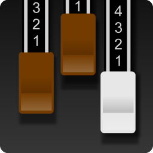

# collab3-setup
The missing desktop icon for [CollaB3](https://sampleson.com/collab3-free-tonewheel-organ.html) on Linux

This installs the missing desktop icon for the Linux standalone audio app. The icon was extracted from the original *.exe installer.

## Usage
CollaB3 must be installed on $HOME/.sampleson/ folder.

Clone repo and execute install script and follow the instructions.

    git clone https://github.com/rolodoom/collab3-setup.git
    cd collab3-setup
    chmod +x main.sh && ./main.sh
